### Proje Hakkında

LearnConnect, kullanıcıların "Yazılım Geliştirme" ve "Tasarım & Yaratıcılık" gibi kategorilerdeki kursları keşfetmelerini ve kaydolmalarını sağlayan, öğrenme deneyimini en üst düzeye çıkarmak için tasarlanmış yenilikçi bir Android uygulamasıdır. Kotlin ile geliştirilen uygulama, MVVM (Model-View-ViewModel) mimarisi ve Temiz Mimari prensipleri takip ederek temiz, ölçeklenebilir ve bakımı kolay bir kod tabanı sunar. Android'in en yeni özelliklerinden yararlanan ve modern yazılım geliştirme standartlarını benimseyen uygulama, yüksek performans ve kusursuz bir kullanıcı deneyimi sağlamak için optimize edilmiştir. Ayrıca kullanıcı ihtiyaçlarına hızlı ve etkili çözümler sunarken, kapsamlı test edilebilirlik ve kolay bakım imkanı sunar.

### Proje Kurulum Adımları

- Adım 1: Temel Yapı ve Bağımlılıklar
Uygulamanın ana yapısı oluşturuldu ve Hilt ile bağımlılık enjeksiyonu entegre edildi.
Gradle yapılandırmaları tamamlandı, alt navigasyon sistemi ve temel UI tasarımları (font, renk, kimlik doğrulama ekranları) implemente edildi.

- Adım 2: İçerik Yönetimi ve Navigasyon
Dinamik kurs listeleme ve kategori yönetimi kuruldu, kullanıcılar için kolay navigasyon sağlandı.
Kategori detayları, derecelendirme sistemi ve modern tasarımlar uygulandı.

- Adım 3: Kullanıcı İşlemleri ve Firebase Entegrasyonu
Firebase kimlik doğrulama entegrasyonu tamamlandı, kullanıcı işlemleri (giriş/çıkış) optimize edildi ve ilgili kullanıcı arayüzleri güncellendi.

- Adım 4: Video ve Kurs İşlevselliği
ExoPlayer ile video işlevselliği entegre edildi, video oynatma hızı ayarları ve ekran döndürme özellikleri eklendi.
Kurslara kayıt olma ve kurs içerikleri üzerinden yönlendirme işlevleri geliştirildi.

- Adım 5: Veri Saklama ve Kullanıcı Ayarları
Room veritabanı kullanılarak veri saklama işlemleri yapılandırıldı. Favori ve kayıtlı kurslar için UI geliştirildi.
Profil ayarları, dil seçenekleri, karanlık tema ve çevrimdışı video izleme özellikleri eklendi.

- Adım 6: Test ve Optimizasyon
Uygulamanın tüm önemli fonksiyonları için unit testler yazıldı.
Kurs detayları ve profil ekranları performans açısından optimize edildi, uygulama Türkçe ve İngilizce dillerini destekler hale getirildi.

### Mimariler & Kütüphaneler

-MVVM & Temiz Mimarlık: Uygulama, MVVM ve Temiz Mimarlık ilkeleri kullanılarak geliştirilmiştir, bu da bakımı ve test edilmesi kolay bir yapı sunar.

-Hilt: Bağımlılıkların yönetimi için Hilt kullanılmıştır.

-Room: Veri saklama işlemleri için Room veritabanı entegre edilmiştir.

-Firebase ve Navigation Component: Firebase kullanıcı kimlik doğrulaması ve Navigation Component ile sorunsuz navigasyon sağlanır.

### Bonus Özellikler

- Çoklu Dil Desteği: Uygulama Türkçe ve İngilizce olmak üzere iki farklı dil seçeneği sunar, kullanıcılar kendi dil tercihlerine göre uygulamayı kullanabilirler.

- Favoriler (Watchlist): Kullanıcılar, ilgi çeken kursları favorilere ekleyerek daha sonra kolayca erişebilir.

- Video Hız Kontrolü: Kullanıcılar, video oynatma hızını kendi ihtiyaçlarına göre ayarlayabilir (ör. 1x, 1.5x, 2x).

- Offline Video İzleme: Kullanıcılar, videoları indirip internet bağlantısı olmadan izleyebilir.

 

| Welcome | Register |  Login
|:-:|:-:|:-:|
| 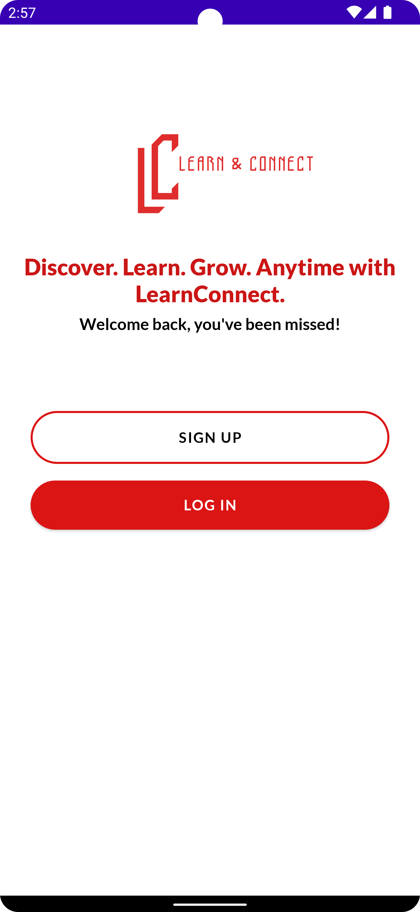 | 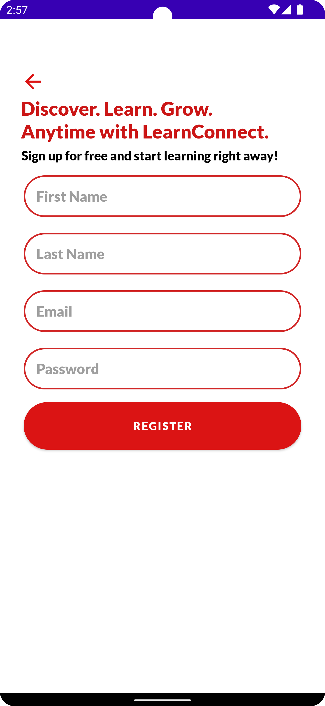 | 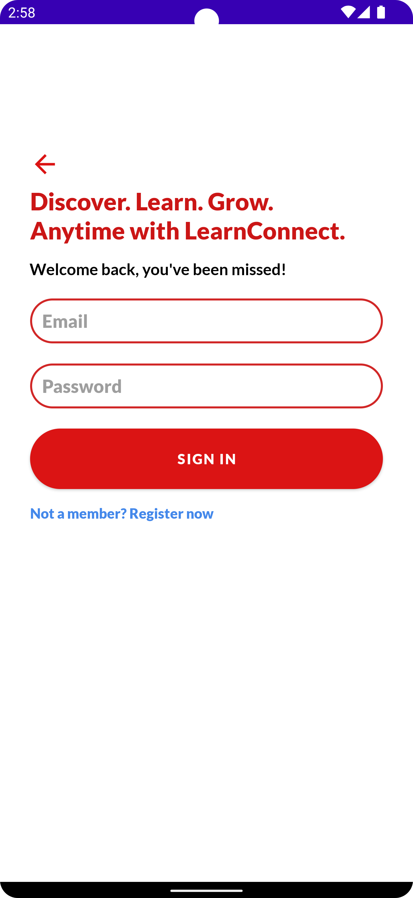 |

| Home | Categories |  Course Detail
|:-:|:-:|:-:|
| 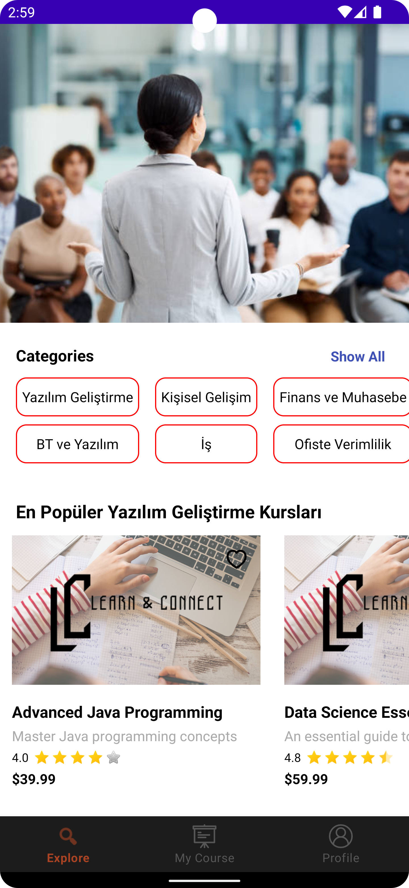 | 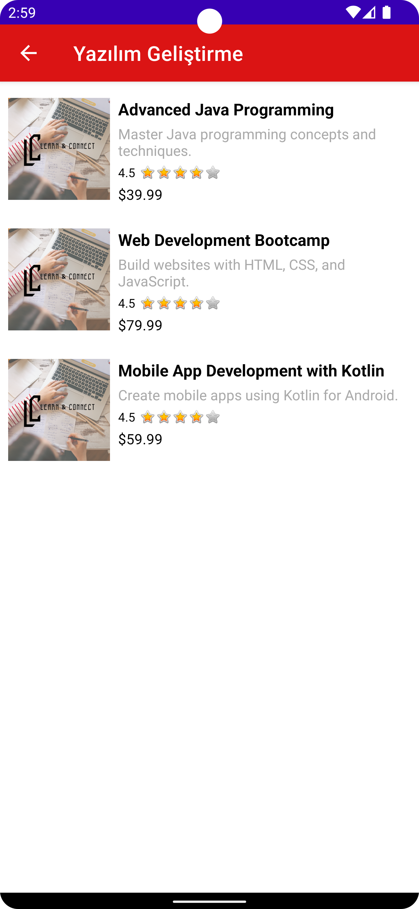 | 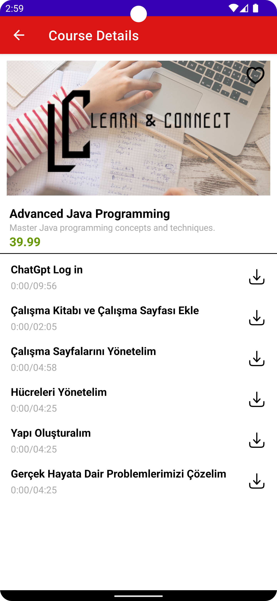 |

| Course Video Player | Video Download |  All Categories  |  Courses
|:-:|:-:|:-:|:-:|
| 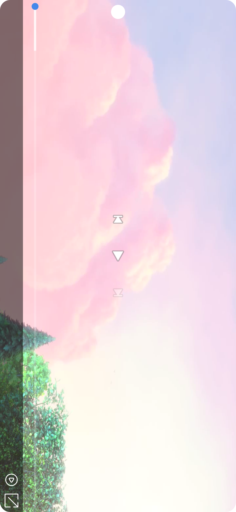 | 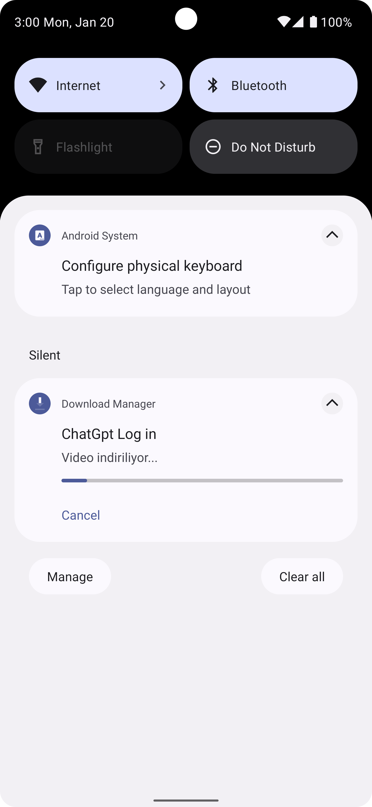 | 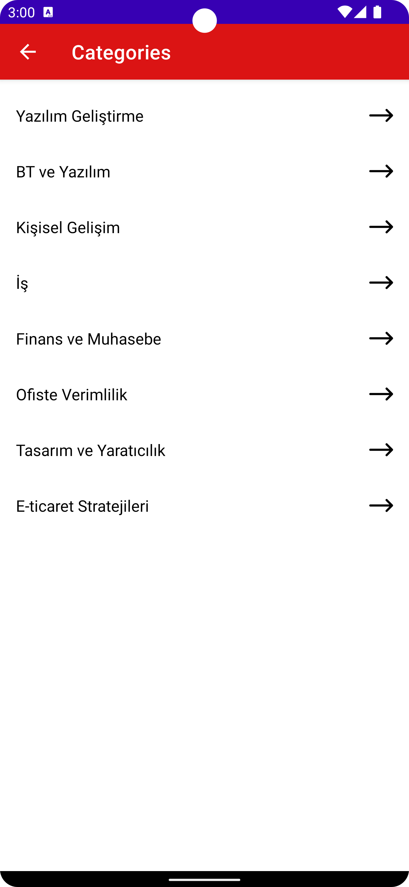 | 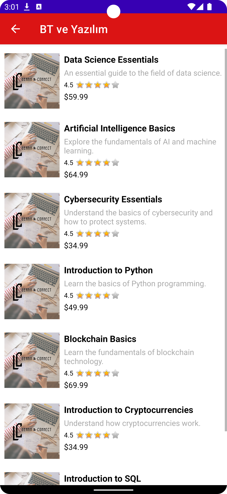 |

| Home Detail | Saved Course |  Profile  |  Downloaded Courses
|:-:|:-:|:-:|:-:|
| 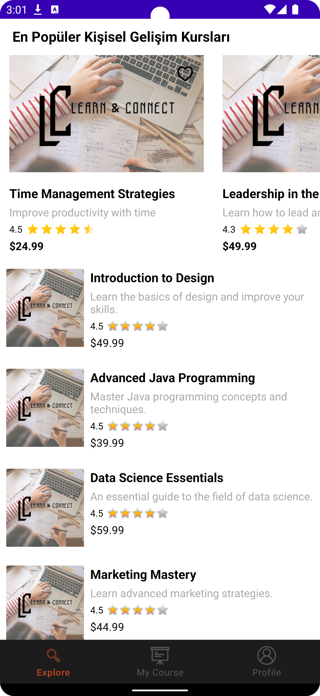 | 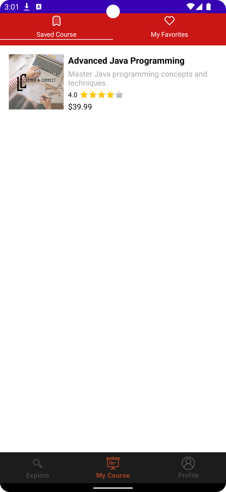 | 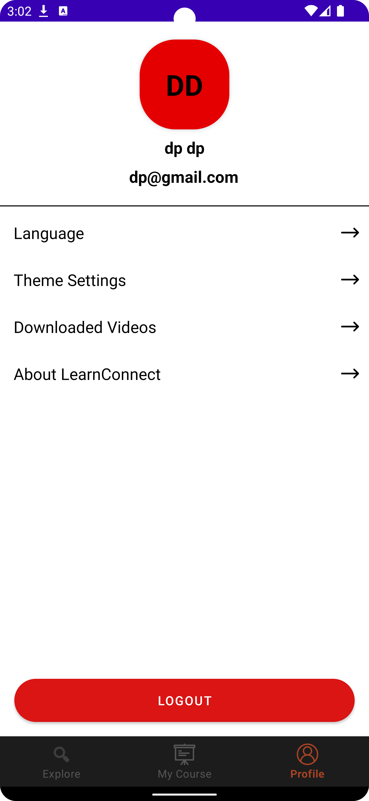 |  |

